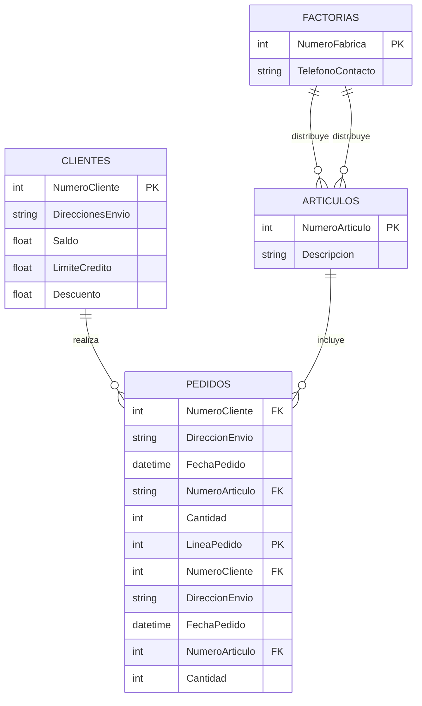

```mermaid
erDiagram
    CLIENTES {
        int NumeroCliente PK
        string DireccionesEnvio
        float Saldo
        float LimiteCredito
        float Descuento
    }
    
    ARTICULOS {
        int NumeroArticulo PK
        string Descripcion
    }
    
    FACTORIAS {
        int NumeroFabrica PK
        string TelefonoContacto
    }
    
    PEDIDOS {
        int NumeroCliente FK
        string DireccionEnvio
        datetime FechaPedido
        string NumeroArticulo FK
        int Cantidad
    }

    CLIENTES ||--o{ PEDIDOS: "realiza"
    ARTICULOS ||--o{ PEDIDOS: "incluye"
    FACTORIAS ||--o{ ARTICULOS: "distribuye"

    PEDIDOS {
        int LineaPedido PK
        int NumeroCliente FK
        string DireccionEnvio
        datetime FechaPedido
        int NumeroArticulo FK
        int Cantidad
    }

    FACTORIAS ||--o{ ARTICULOS: "distribuye"
```


```
npm i
```

```
npm run dev
```
